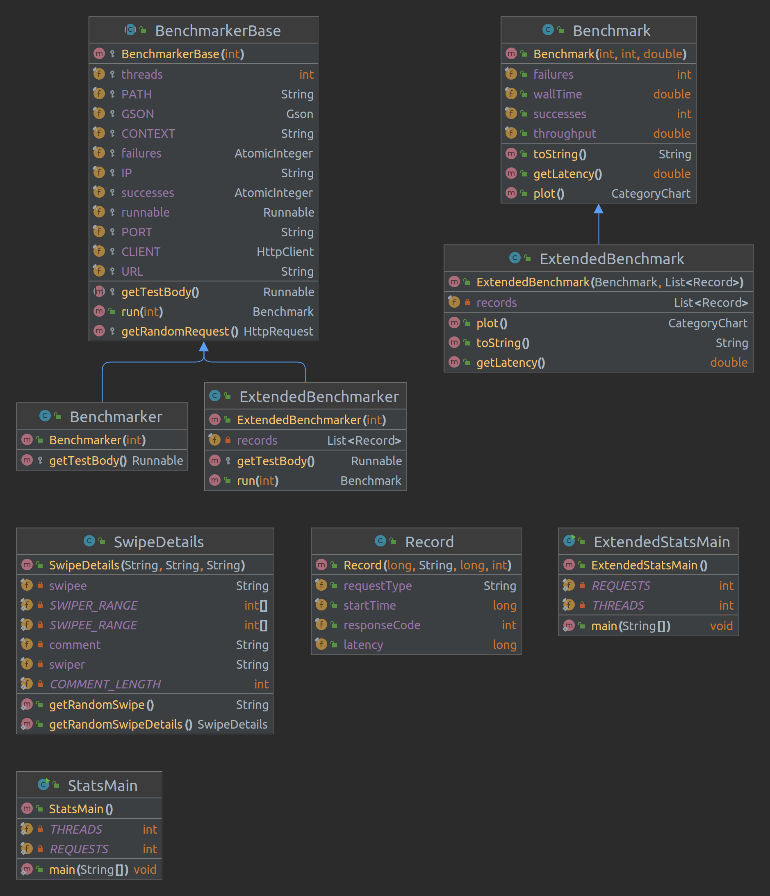
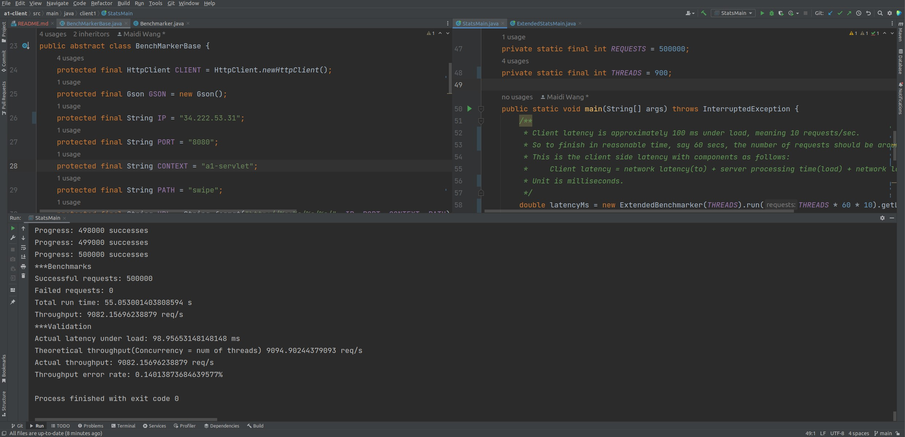
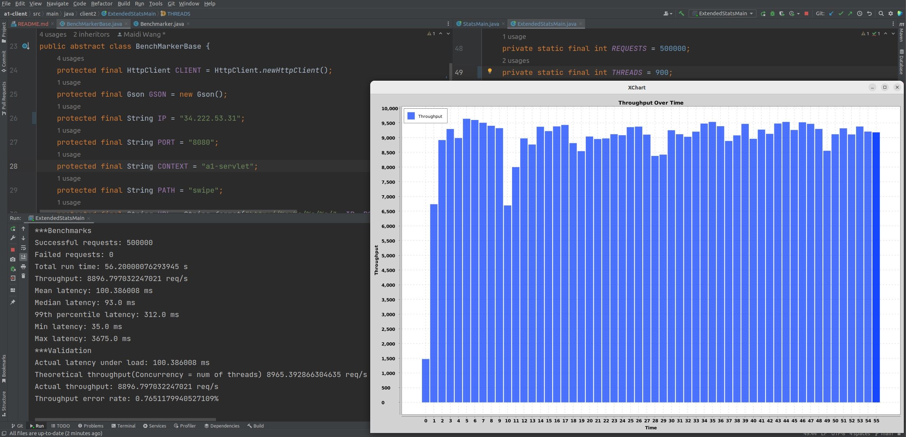

# Assignment 1

This is the intellectual work of **Maidi Wang**.

## Project URL

https://github.com/PerseusW/DistributedSystems

The code for client part 1 and part 2 are in separate folders under `a1-client/` directory.

## Client Design

The UML diagram for my classes:

All my classes are sufficiently documented, but it helps to have a central document where all parts are in the same picture.

### SwipeDetails

This class is a direct representation of the `SwipeDetails` given in swagger specification [here](https://app.swaggerhub.com/apis/IGORTON/Twinder/1.0.0#).

I have added some additional functionality within the class to automatically generate random instances that satisfy requirements, namely generating `SwipeDetails` with fields either within a particular range or of a particular length.

If you want to dig into it, generating a fixed length random alphabetic string was quite fun.

### BenchmarkerBase

This is a crucial class in a lot of ways:

1. This class is the single point in the project that specifies IP, PORT, Context Path and other network specific configurations. It's a great help in that when my EC2 instance's IP changes, or when I want to test `Spring Server` instead of my `Bare Servlet`, only **1** piece of code needs to be changed.
2. It minimizes code redundancy for client part 1 and part 2 by combining common objects needed in the base class and having client 1 and 2 inherit instead of duplicate code.
3. It takes care of random request generation and provides it as a function for client 1 and 2.
4. It neatly takes care of thread pool creation/deletion and exposes a point of extension for subclasses to inject their unique logic through a runnable object.

Summing up, this class is a single-stop for handling network configuration, thread pool management to reduce redundancy, and makes use of Java's inheritance mechanism to achieve polymorphism.

### Benchmark

This is the basic result that benchmarkers will yield after sending requests and receiving responses.

It only provides printable text reports using metrics given at creation. It is also the base class for `ExtendedBenchmark`.

### Benchmarker

This is a specialized version of BenchmarkerBase that simply sends 1 POST request with random SwipeDetails, retries 5 times on failure, and logs the outcome "failure/success". 

It is the bare minimum needed to satisfy client part 1 specifications.

### StatsMain

The comments on top of this class are important and self-explanatory, so I'm only summing up the conclusions here:

1. Concurrency/Throughput bottleneck is nearly always at client side because client latency is much higher than server latency.
2. Concurrency < number of threads, due to synchronization overhead.
3. Server latency can change under load and thus change client latency.

On top of the required output, I've also implemented automatic validation using estimated under-load client latency. The process is as following:

1. Use `ExtendedBenchmarker` to get average latency of a certain number of requests using the same number of threads I plan to use with `Benchmarker`.
2. Calculate theoretic throughput with **thread nums** and **under-load latency**.
3. Compare with actual latency yielded from `Benchmarker`, and give out an error rate between theory and actual.

### Client Part 2

It extends on client part 1 in 2 ways:

1. `ExtendedBenchmarker` records extra properties of each request: {startTime, type, latency, response code}.
2. `ExtendedBenchmark` calculates extra metrics required and renders a bar-chart using XChart.

## Client Part 1 Output

I've noticed a few interesting facts:

1. It's easy for throughput to get throttled by network for sending out requests at this rate. (flagged as DOS attack maybe?)
2. Throughput varies across different times of the day. It's faster during mornings and slower at night.

This suggests that the bottleneck might be neither the client nor the server, but actually the Internet. (local network, ISP, AWS backend, data center load, etc..)

Below are metrics taken at noon, when throughput is the highest:

As you can see from the picture, configurations are:

1. Sending requests to **remote EC2 instance's bare servlet**.
2. Sending a total of **500k random requests**.
3. Using a thread pool with **900 threads**.

Wall time is **55** seconds and actual throughput is **9082 requests/second**.

The mean **under-load latency** yielded from the pre-run is 98.96 ms, and the number of threads is **900**, so theoretical throughput according to Little's Law is **(900 / 0.09896) = 9094 requests/second**.

The difference between actual throughput and theoretical throughput is merely **0.14%**.

These metrics are amazingly high and suggest that my **bare servlet** implementation is performance robust, and I would happily reproduce these results if needed, but just so you know, throughput only gets so high during morning times, and drop to around 6000 requests/second at night.

On another thought, the latency under **no load** is approximately 65 ms, and I'm trading off latency for throughput. But since the goal of this project is optimal throughput, such a tradeoff can be justified.

## Client Part 2 Output

Part 2 is essentially the same as part 1 but with more metrics. These metrics were produced in a run right after part 1:

The throughput numbers are quite similar, slightly dropping from 9000 to 8900, which is **2%** change. And the latency distribution is as expected, with **99%** of requests finishing within **312 ms** for a tradeoff of higher throughput.

The **|Throughput Over Time|** bar-chart is also directly visible within the picture. I plotted it with a Java-native library called XChart. No file IO or Excel was required.

## Comparison with Spring Server

Spring's throughput is way lower and waiting for 500k requests takes 3 minutes to finish:

As you can see, Spring only has a throughput of around 2900 requests/second.
