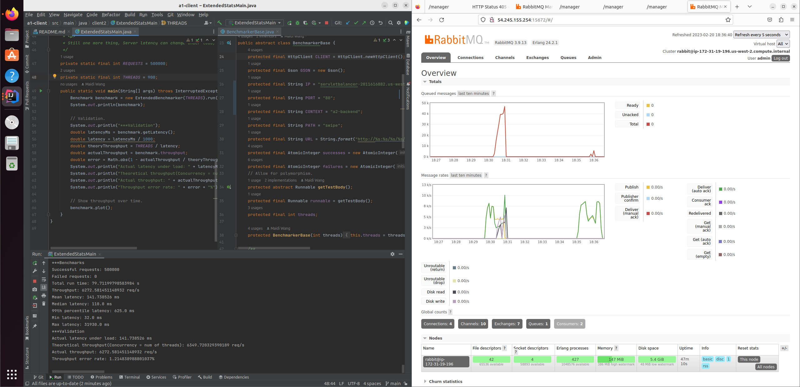

# Assignment 2

This is the intellectual work of **Maidi Wang**, all rights reserved.

## Github Repo

This is the link for my Github repo: https://github.com/PerseusW/DistributedSystems

This file should be the README for `a2-backend`.

## Server Design

This backend design builds on top of a1-servlet, with extensions regarding RabbitMQ, where the servlet redirects requests to RabbitMQ for consumers to consume.

Let's walk through how requests are handled:

1. User sends a post request from browser to server.
2. Tomcat maps that request to our servlet.
3. Servlet checks if parameters are valid or not, then forward the request to RabbitMQ.
4. RabbitMQ forwards requests to consumers that have registered themselves to RabbitMQ.

During this entire workflow, 2 IP addresses are needed:

1. Server IP address: since browser needs to send requests to server.
2. RabbitMQ instance IP address: servlet needs to forward requests to RabbitMQ and consumers need to register themselves to RabbitMQ.

The current design is mostly due to fact that we want to change as least IP addresses as possible, since IP addresses change upon each restart of EC2 instances. So, we have the servlet and consumer sharing a RabbitMQ class, where configurations for RabbitMQ only needs to be specified once.

## Single Instance Test

To clarify things in the screenshot:

1. Client is sending 500k requests. (Intellij left)
2. Client is using a thread-pool with 900 threads. (Intellij left)
3. Client is sending requests directly to a single remote servlet instance. (Intellij right)
4. Theoretical throughput is 4600 while actual throughput is 4550. (Intellij bottom terminal)
5. RabbitMQ is running on AWS EC2 instance. (Firefox top right)
6. RabbitMQ queue size is always 0 during test. (Firefox top chart with red line)
7. Throughput chart is roughly the same for RabbitMQ and XChart. (Firefox middle chart with green line, XChart)
8. 3 connections are made up of 2 servlets + 1 consumer.
9. 9 channels are made up of 2 * 4 servlet channels + 1 * 1 consumer channel.

## Double Instance Test

To clarify:

1. Client is sending requests to a load-balancer domain name, with 2 servlets as backend. (Intellij right)
2. Theoretical throughput is 6350 while actual throughput is 6275, much higher than single instance test. (Intellij bottom terminal)
3. Queue length stays 0 most of the time, with a minor fluctuation where it raises to 5k. (Firefox charts)
4. 4 connections are made up of 2 servlets + 2 consumer.
5. 10 channels are made up of 2 * 4 servlet channels + 2 * 1 consumer channel.
