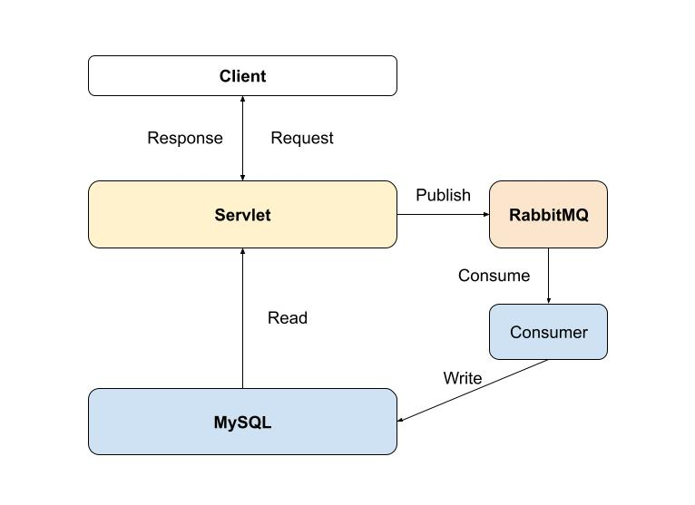
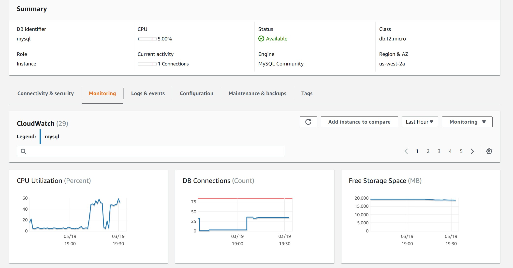
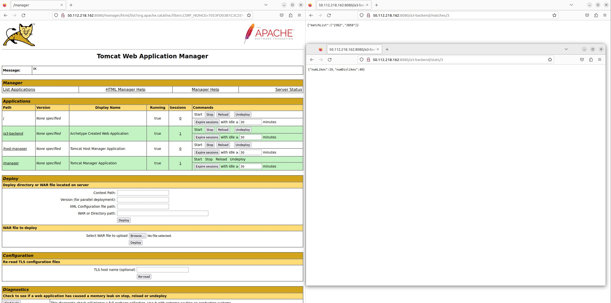
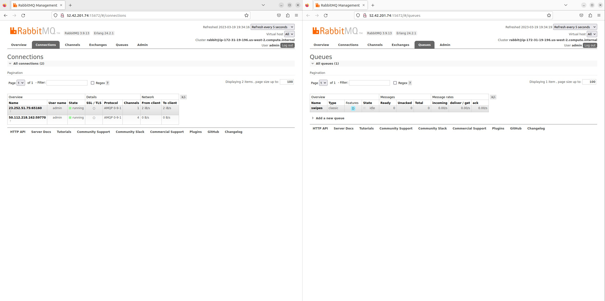
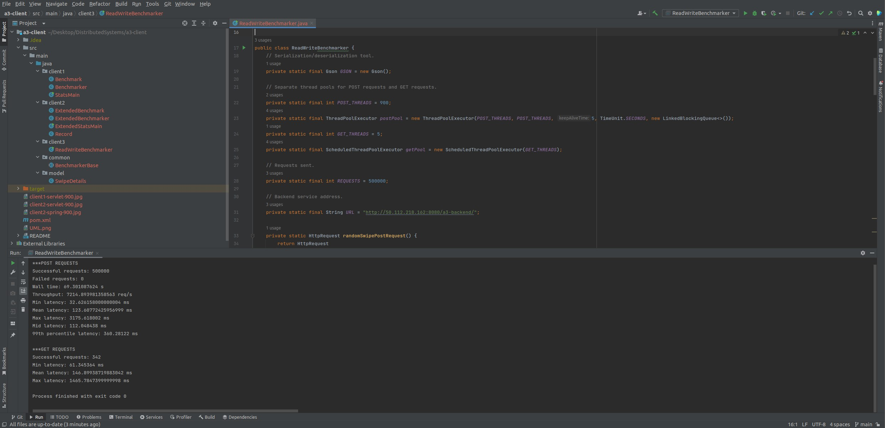
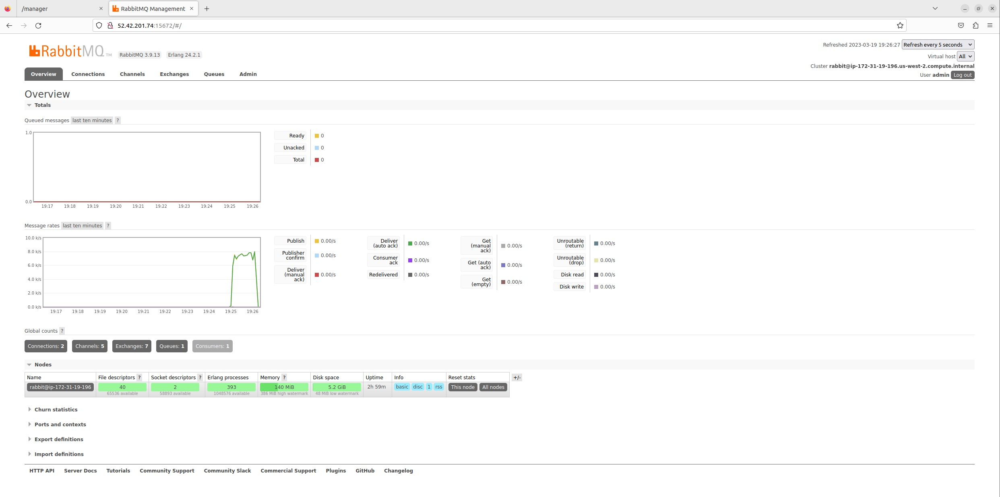
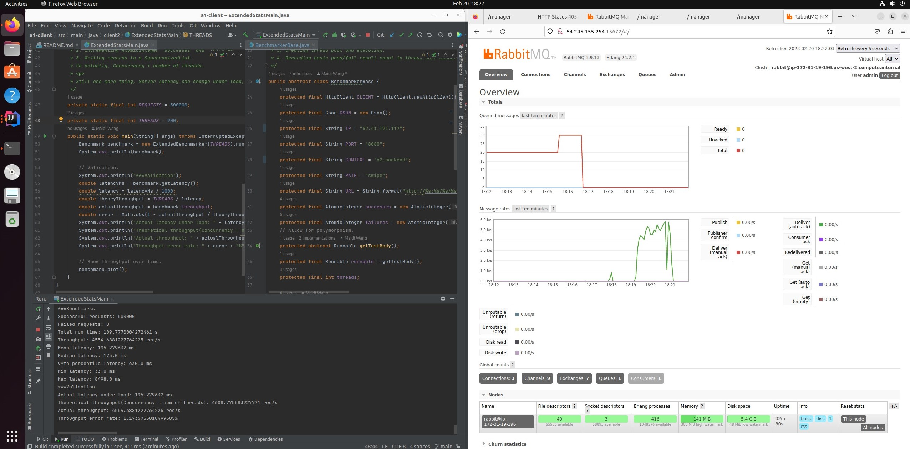

# Assignment 3

This is the intellectual work of **Maidi Wang**, all rights reserved.

## Github Repo

This is the link for my Github repo: https://github.com/PerseusW/DistributedSystems

This file should be the README for `a3-backend`.

## Overall Design



The overall structure of my solution is as the diagram above, with each box running as its own instance. As you can see, the servlet published write requests to RabbitMQ, where the consumer writes data to the database. In the meanwhile, the servlet reads data from the database directly. Another thing worth noting is that apart from MySQL, all other backend components can scale out.

## Client Design

The code for assignment 3's client is mainly in package **client3**. The logic was rewritten to incorporate an additional read thread that fires off periodically.

There are 2 thread pools in client 3:

1. ThreadpoolExecutor postPool: this pool takes care of POST requests and storing the outcome and latency of each POST request.
2. ScheduledThreadPoolExecutor getPool: this pool fires off at intervals of 200ms, with each invocation resulting in a random GET request of either matches or match stats, and stores the latency of that request.

## Database Design

I decided to go with the classic MySQL, for the following reasons:

1. The swipe model that we are to implement can be intuitively translated into a relational model.
2. AWS natively supports MySQL.
3. I'm natively familiar with MySQL.

For our swipe model, it can be described in 1 table to achieve what we need:

```mysql
CREATE TABLE swipes(
    swiper VARCHAR(256) NOT NULL,
    swipee VARCHAR(256) NOT NULL,
    comment VARCHAR(256),
    swipe ENUM('left', 'right') NOT NULL,
    PRIMARY KEY(swiper, swipee)
);
```

Every swipe POST request is intuitively a row in this table, and the 2 GET requests can be expressed in SQL, allowing us to delegate query processing to the database, saving communication overhead and simplifying the servlet. For these 3 functions, they can be translated into the following SQL statements:

```mysql
# POST a SwipeDetail
INSERT INTO swipes(swiper, swipee, comment, swipe) VALUES(?,?,?,?)

# GET matches for a user. Matches for 'a' means the intersection of people who 'a' likes and who likes 'a'.
SELECT likes.swipee FROM swipes AS likes INNER JOIN swipes AS liked ON likes.swipee = liked.swiper AND likes.swiper = liked.swipee WHERE likes.swiper = ? LIMIT 100

# GET match stats for a user.
SELECT SUM(CASE WHEN swipe = 'right' THEN 1 ELSE 0 END) AS likes, SUM(CASE WHEN swipe = 'left' THEN 1 ELSE 0 END) AS dislikes FROM swipes WHERE swipee = ?
```

The data access object for this table is implemented as `database.SwipesTable`. Relevant configurations are abstracted into an interface.

On AWS, I used AWS RDS as a frustration free solution (did have some trouble setting up the virtual security group though). The web-ui looks like this (had to hide some personal information for safety):



## Backend Design

### Servlets

Servlets build upon assignment 2, with 2 additional servlets that take care of */matches/{userId}/* and */stats/{userId}/*. Implementing the functionality of these 2 servlets require introducing a database source, which I have done so with MySQL. Below is a picture showing the functionality of the servlets:



### RabbitMQ

I have chosen to stick with RabbitMQ as a message broker, and to satisfy assignment requirements, I've tweaked with RabbitMQ to make both the queue durable and messages persistent. The source code changes are within `service.RabbitMQ` where the queue declaration is changed and where swipes are published with additional properties to specify that it is consistent. Below is a screenshot showcasing that the queue has the durable feature activated:



### Consumer

The consumer is just a plain old java program that takes messages from the queue and inserts it into MySQL.

## Test Results





These are the screenshots of my client output and rabbitmq management web-ui for one of my best attempts.

These are the results from assignment 2:



As you can see, my solution for assignment 3 is way better than assignment 2, and this is mainly because I've changed the way how objects are stored in RabbitMQ. For assignment 2, SwipeDetails were stored using Java's **Serializable** interface, but for assignment 3, SwipeDetails are globally serialized and deserialized with Gson, giving me less overhead. As evidence, assignment 3's throughput and latency agree more with the numbers I've seen in assignment 1, and assignment 2's sudden drop suggest a bottleneck forming on the consumers because of the serialization overhead forming on using **Serializable** interface.
